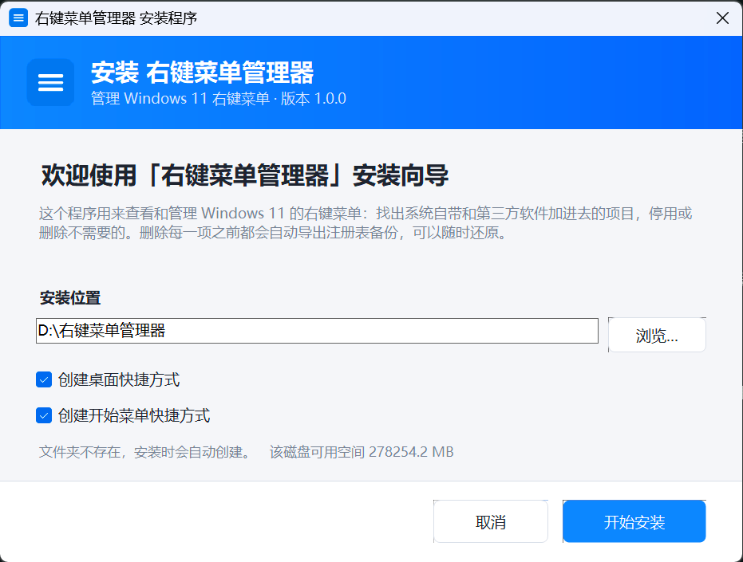
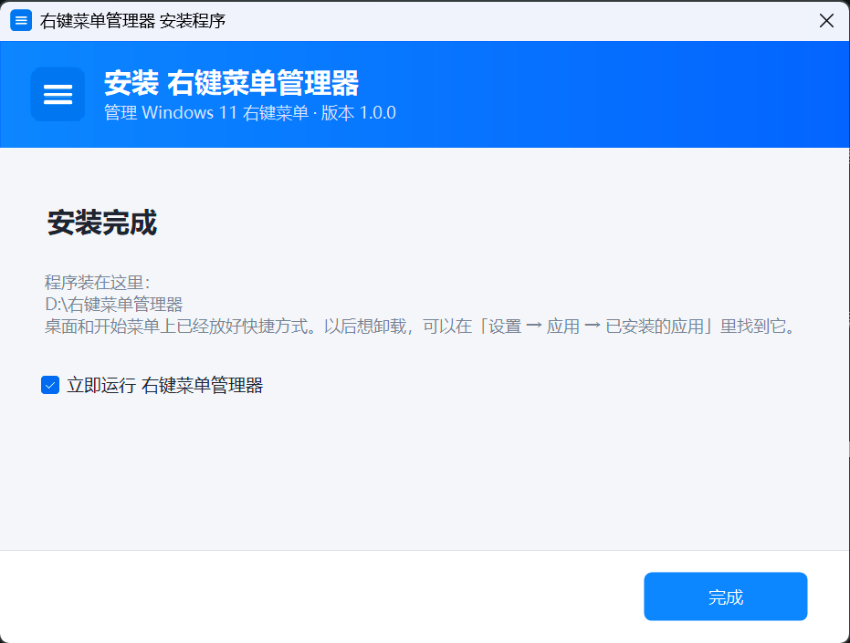
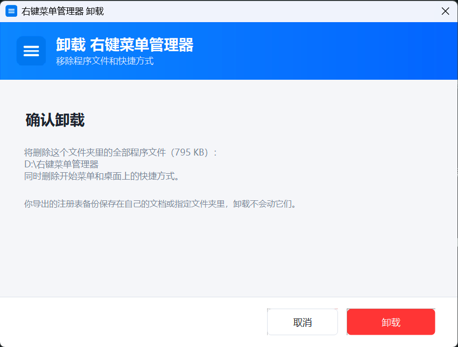

# Windows 11 右键菜单管理器

一个免安装的 Windows 小工具：**看清楚是谁往你的右键菜单里塞了东西**，然后把不需要的项停用或删掉。

删除任何一项之前都会先导出注册表备份，随时能还原。







## 下载

到本仓库的 **[Releases](../../releases)** 页面下载安装包，解压后双击里面的安装程序，跟着向导装完即可。
它会创建桌面和开始菜单快捷方式，也会登记到「设置 → 应用 → 已安装的应用」里，可以正常卸载。

**系统要求**：Windows 10 / 11 ＋ [.NET 8 桌面运行时](https://dotnet.microsoft.com/download/dotnet/8.0)（免费）。
没装的话，安装程序会提示你并给出下载页。

> 安装时 Windows 可能弹「未知发布者」的提示，因为安装包没有代码签名。程序不联网、不收集信息。

## 它能做什么

### 一、看清是谁往你的菜单里塞了东西

列表里每一行就是右键菜单里的一项。最上面两个下拉可以叠加筛选：

- **按来源**：全部来源 / Windows 自带 / 第三方软件 —— 想看「谁动了我的菜单」就选第三方软件
- **按位置**：右键文件时、右键文件夹时、文件夹空白处、桌面空白处、快捷方式、exe、驱动器、
  「发送到」菜单、Win11 现代菜单、仅某种文件类型…… 一共 12 种

列可以排序；最左边的搜索框能搜名称和程序路径。「哪个程序」这一列专门用来跟真实菜单对号：
你在菜单里看到「用 HiBit Uninstaller 卸载」，按这一列找到 `HiBitUninstaller.exe` 就是那一条。

名称后面带「（共 N 处）」的，说明同一个程序在 N 个地方各注册了一份（压缩软件常见，它认识的每种
扩展名下都挂一份）。它是一条代表，停用或删除会把 N 处一起处理，不会漏掉。

### 二、找出软件卸载后留下的垃圾

勾上「**只看失效残留**」，剩下的就是「指向的程序已经不在硬盘上」的项，多半是某个软件卸载没卸干净
留下的空壳，删掉不会有影响。

程序不会瞎猜：只有它确实拿到了完整路径、而且那个文件真的不存在，才会标成失效。如果命令里只写了
一个程序名（比如 `powershell.exe`），它会去系统目录和 `PATH` 里找一遍，找不到也不下结论。

### 三、让它消失（两种做法，都留后路）

- **停用** —— 什么都不删，只让它在菜单里不出现，想反悔就点「恢复启用」。拿不准的先用这个试。
- **删除** —— 先把这一项完整备份成一个文件，再删掉。备份默认放在 `我的文档\右键菜单备份\`，
  文件名带时间戳；想换地方（比如 D 盘或网盘同步目录）在「备份与还原」页点「更改位置」，选择会记住。
  删错了，到「备份与还原」页点「还原选中」就回来了。

这两种操作都支持一次处理多项：按住 `Ctrl` 点选、`Shift` 连选，或者点「批量选择」用勾选框
（旁边还有「全选」）。选中多项时按钮会变成「停用这 N 项」「删除这 N 项（先备份）」。
操作完列表会停在原地，不会把你弹回最上面。

### 四、把右键菜单变回 Windows 10 那样

点右上角「**切换完整右键菜单**」。Windows 11 默认把菜单折叠成一小撮，要点「显示更多选项」才看得全；
切换之后所有项目直接展开，跟 Win10 一样。想变回去再点一次。

## 改完没反应？

右键菜单是「资源管理器」在管，改完要重启它才生效。程序每次改完都会问你要不要现在重启
（桌面图标和任务栏会消失一两秒然后自己回来，已经打开的窗口和正在做的事不受影响）。
也可以随时点右上角的「重启资源管理器」手动来一次。

## 关于权限

程序默认用普通权限运行，这时只能改「当前用户」的项。遇到来源是「系统（本机）」的项，删除时程序会
告诉你改不动 —— 这时点右上角「以管理员身份重启」，Windows 弹一次权限确认框，授权之后系统级的项
也能改。程序不会一上来就找你要管理员权限，用不上的时候不打扰你。

## 安全承诺

- 「扫描」这一步是纯读取，绝对不动任何东西
- 任何删除动作之前，一定先生成备份文件；备份没成功就不删
- 备份是标准的 `.reg` 文件，双击它也能还原，也能留着自己看
- 程序**不联网、不收集信息、不上传任何东西**
- 想卸载：从「设置 → 应用」卸载，或直接删掉安装文件夹
  （唯一的痕迹是备份文件夹里的 `.reg`，可以自行删除）

想自己验证它靠不靠谱，在命令行里跑：

```
右键菜单管理器.exe --selftest 结果.txt
```

它会临时造几个假的菜单项，把「扫描 → 备份 → 停用 → 恢复 → 删除 → 还原」整条链路真跑一遍，
把结果写进 `结果.txt`，然后把自己造的东西全部清掉。只写当前用户，不需要管理员权限，也不会碰你
真实的菜单项。

## 从源码编译

需要 **.NET 8 SDK**（`global.json` 指定 8.0 系列并带 `rollForward: latestFeature`，所以任意 8.x
补丁版本都能编译）。本项目**不依赖任何第三方 NuGet 包**。

主程序：

```
cd RightMenuManager
dotnet build -c Release
```

安装程序 —— 它要把主程序的编译结果**内嵌**进自己，所以要先刷一遍 payload：

```
# 1) 把主程序的编译输出复制进安装程序的 payload 目录
#    bin\Release\net8.0-windows\ 下的
#      右键菜单管理器.exe / .dll / .deps.json / .runtimeconfig.json
#    再加上「使用说明.txt」
#
# 2) 编译安装程序
cd RightMenuManager.Setup
dotnet build -c Release
```

> ⚠️ **已知问题**：`RightMenuManager.Setup\payload\` 目前是**手工同步**的——没有任何机制在主程序
> 编译后自动刷新它。改了主程序却忘了重刷 payload，安装包装出来的会是旧程序，而且从现象上看不出来。
> 欢迎提 PR 把它变成自动的。

## 目录结构

```
RightMenuManager/                 主程序（WinForms）
├── src/
│   ├── Program.cs                入口 + 命令行自测
│   ├── MainForm.cs               界面、布局、列表
│   ├── Scanner.cs                扫描注册表、合并重复注册
│   ├── SystemActions.cs          备份 / 停用 / 删除 / 还原、经典菜单开关
│   ├── Model.cs                  菜单项数据模型
│   ├── Ui.cs                     配色与圆角按钮
│   └── Win32.cs                  Win32 与注册表小工具
├── tools/                        开发期辅助脚本（图标生成、界面验证）
└── global.json / NuGet.config    固定 SDK 版本、清空包源（离线也能编译）

RightMenuManager.Setup/           安装程序
├── src/                          安装引擎与向导界面
├── payload/                      会被内嵌进安装程序的文件
└── tools/                        安装流程的自动化验证脚本

screenshots/                      README 用的界面截图
```

## 它是怎么认出一个菜单项的

扫描范围包括 `HKEY_CLASSES_ROOT` 下的 `*`、`AllFilesystemObjects`、`Directory`、
`Directory\Background`、`Drive`、`Folder`、`DesktopBackground`、`LibraryFolder`、
`SystemFileAssociations\*`、各类文件类型键（`lnkfile` / `exefile` / `.ext`），以及 `SendTo` 目录，
还有 Windows 11 的稀疏包（`PackagedCom`，就是 QQ、Bandizip 那类用新方式注册的菜单）。

显示名按 `LocalizedString` → `MUIVerb` → 默认值 → 委托的 CLSID 名称 → 目标 DLL 的版本信息
→ 注册表键名 依次回退，尽量显示成你在菜单里真正看到的那个名字。

同一个程序在多处注册的项会合并成一行，界面上标「（共 N 处）」。

## 许可

[MIT](LICENSE) —— 随便用、随便改、随便分发，但**按现状提供，不保证任何东西**。
这个工具会修改你的注册表（尽管每次都先备份），使用前请自行判断风险。
